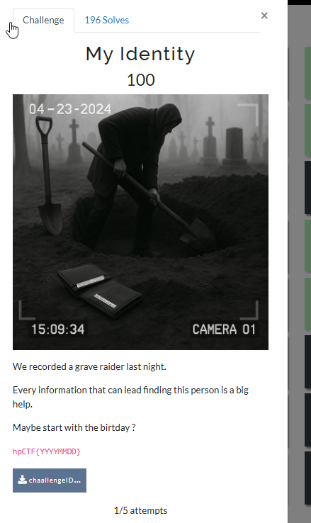
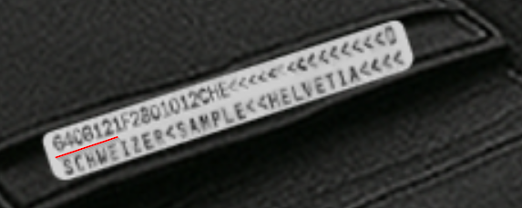
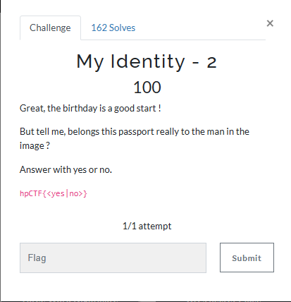
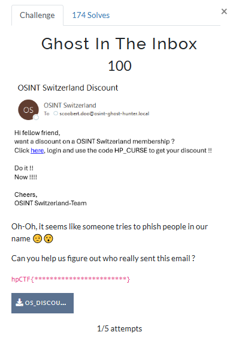
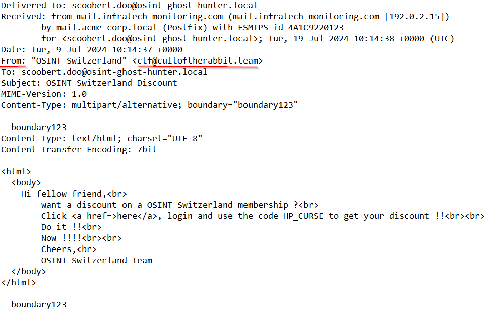
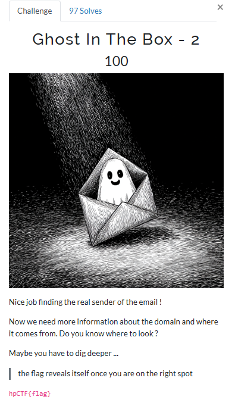
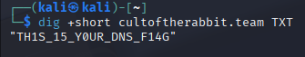
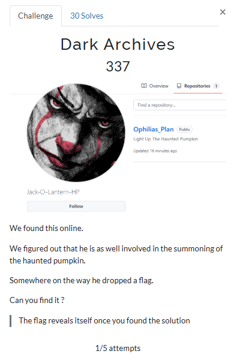
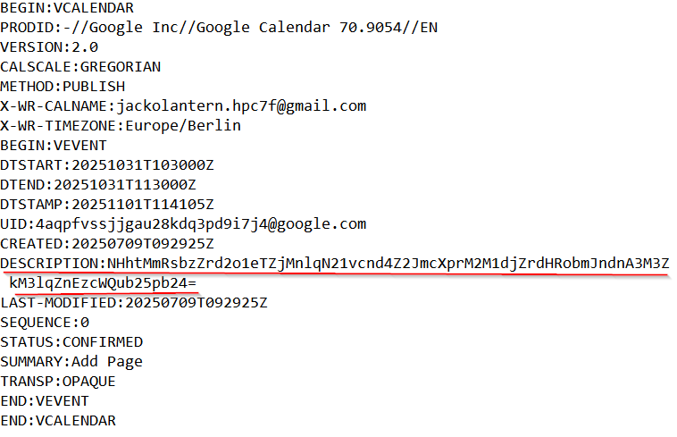
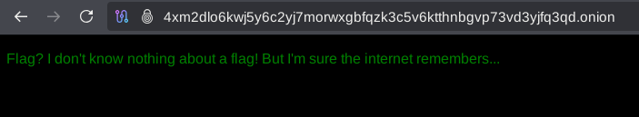

1. My identity  

If we zoom on the wallet we can see an identity card with the birthday on it.

Flag: hpCTF{19640812}

2. My Identity - 2

We could assume the wallet was from the person he buries.

Flag: hpCTF{no}

3. I Like Trains

The first thing I tried was reverse image search with Google Lens. which led me to this video
https://www.youtube.com/watch?v=kqp9uFIQtMM&t=1s
In the description of it we can identify a few important details (Rotary snowplows of Rhätische Bahn) which leads us to the classification code Xrot d 9213

Flag: hpCTF{X rot d 9213}

4. Ghost In The Inbox

If we open the file with notepad we can see a key detail

Flag: hpCTF{ctf@cultoftherabbit.team}

5. Ghost In The Box - 2

For this challenge we just had to use the dig command to check DNS records. you can skip the +short part of the command for extra information.

Flag: hpCTF{TH1S_15_Y0UR_DNS_F14G}

6. Dark Archives

The first thing we do is search him on github where we can see that he has only one repository that doesn't expose us to anything useful. Then I checked the commit history, to verify if anything got removed or added with the following commands:

git clone https://github.com/Jack-O-Lantern-HP/Ophilias_Plan.git
cd Ophilias_Plan
git log -p

Which exposed his email: jackolantern.hpc7f@gmail.com

then I ran ghunt on it and found a calendar link
https://calendar.google.com/calendar/ical/jackolantern.hpc7f@gmail.com/public/basic.ics that had a description

It looked like a base64 encoding so I used dcode to decode it which lead me to a tor link:
	4xm2dlo6kwj5y6c2yj7morwxgbfqzk3c5v6ktthnbgvp73vd3yjfq3qd.onion

An almost empty html page that hinted to an archive of the link

Then I pasted the link into archive.li which revealed the flag

Flag: hpCTF{N1C3_Y0U_G0T_4N07H3R_0N3_4724}
